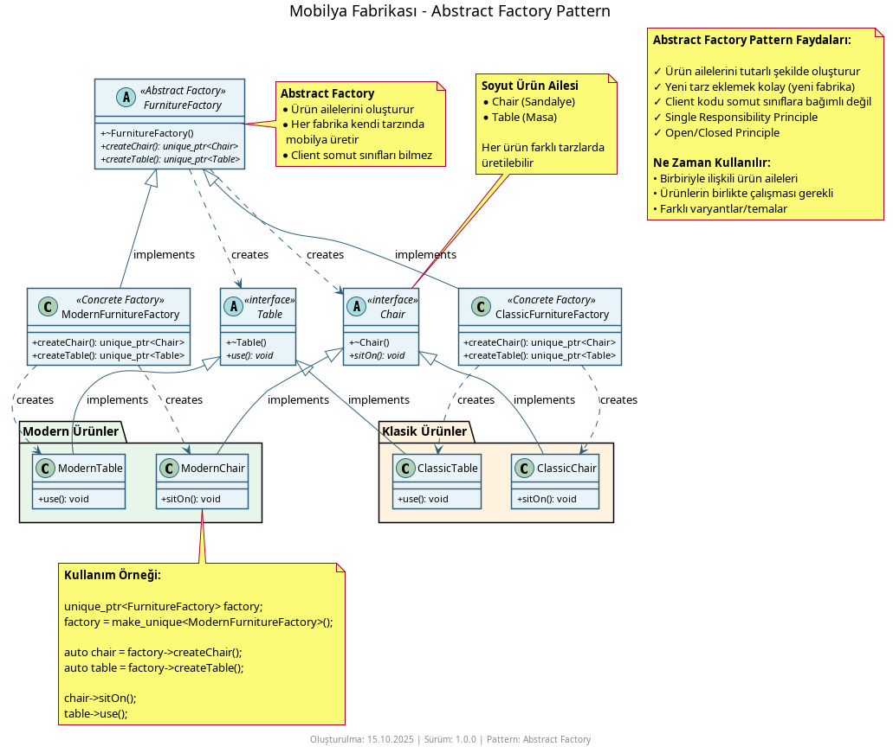
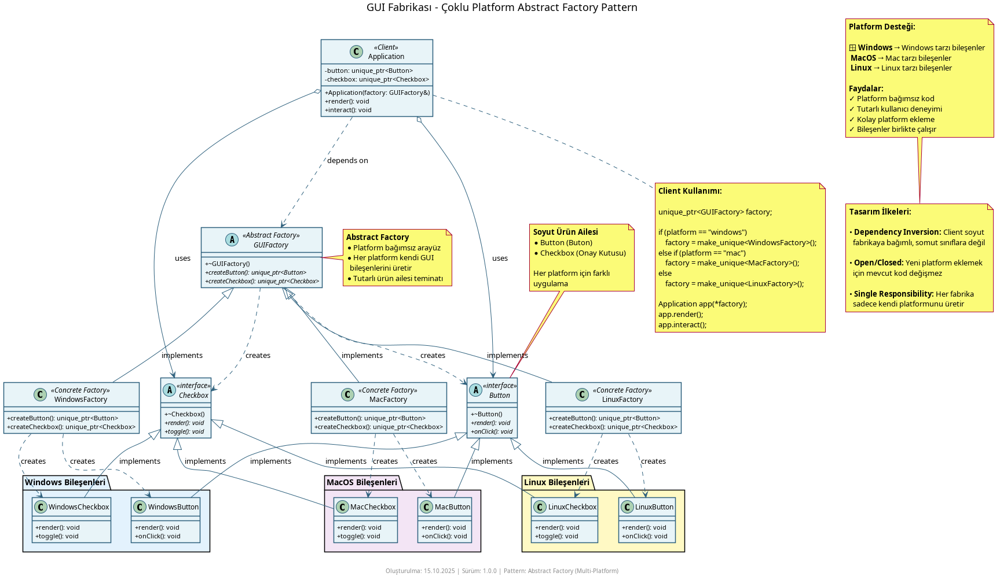
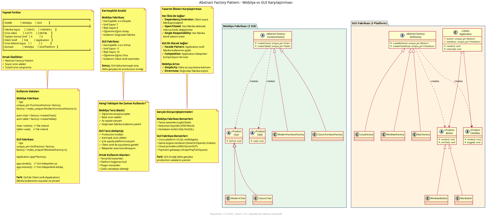

# Abstract Factory Pattern Nedir?

**Abstract Factory Pattern**, birbiriyle ilişkili veya bağımlı nesneler ailesi oluşturmak için kullanılan bir **oluşum kalıbıdır (creational pattern)**. İstemci kodu somut sınıflara bağlı kalmadan ürün aileleri (mesela Modern mobilya takımı, Windows GUI bileşenleri) oluşturabilir. Farklı platformlar veya temalar için tutarlı ürün takımları üretilmesi gereken durumlarda idealdir.

## Ne İşe Yarar?

- **Ürün ailelerini bir arada yönetir** - Birbirleriyle uyumlu birden fazla nesne (örn. sandalye + masa, buton + onay kutusu) aynı fabrika üzerinden üretilir
- **Platform bağımsızlığı** - Windows, Mac veya Linux gibi farklı platformlar için GUI bileşenleri üretirken istemci kodu değişmez
- **Tutarlılık güvencesi** - Aynı fabrikadan üretilen tüm ürünler birbiriyle uyumludur (Modern fabrikadan klasik ürün çıkmaz)
- **Genişletilebilirlik** - Yeni bir ürün ailesi eklemek için sadece yeni bir fabrika sınıfı oluşturulur

## Örnekler

### 1. Mobilya Fabrikası



Bu örnekte `ModernFurnitureFactory` ve `ClassicFurnitureFactory` kullanılarak Modern veya Klasik mobilya takımları oluşturulur. Her fabrika kendi takımında sandalye ve masa üretir.

```cpp
// Kullanım
std::unique_ptr<FurnitureFactory> factory = std::make_unique<ModernFurnitureFactory>();
auto chair = factory->createChair();
auto table = factory->createTable();
chair->sitOn();
table->use();
```

### 2. GUI Bileşenleri Fabrikası



Bu örnek, `WindowsFactory`, `MacFactory` ve `LinuxFactory` ile farklı platformlar için GUI bileşenleri (Button, Checkbox) oluşturur. Her platform kendi görsel tarzına sahip bileşenler üretir.

```cpp
// Örnek
std::unique_ptr<GUIFactory> factory = std::make_unique<WindowsFactory>();
Application app(*factory);
app.render();
app.interact();
```

### 3. İki Örneğin Karşılaştırması



GUI ve Mobilya örneklerinin farklı kullanım senaryolarını ve benzerliklerini görsel olarak gösterir:
- **GUI:** Platform bağımsız arayüz bileşenleri
- **Mobilya:** Stil tutarlılığı gerektiren ürün takımları

## Nasıl Çalışır?

1. **Soyut Fabrika Arabirimi:** Tüm ürünleri oluşturacak yöntemleri tanımlar
2. **Somut Fabrikalar:** Her ürün ailesi için özel fabrika (ModernFactory, WindowsFactory vb.)
3. **Soyut Ürünler:** Ürün ailelerinin ortak arabirimleri (Chair, Button vb.)
4. **Somut Ürünler:** Her fabrikaya özgü ürün gerçeklemeleri (ModernChair, WindowsButton vb.)

İstemci kodu sadece soyut fabrika ve soyut ürünlerle çalışır. Bu sayede somut sınıflara bağımlılık olmaz ve çalışma zamanında farklı ürün aileleri kolayca değiştirilebilir.

## Ne Zaman Kullanılır?

- **Birbirleriyle uyumlu ürün aileleri gerektiğinde** – Örneğin bir tema için tüm GUI bileşenleri aynı stilden olmalı
- **Platform bağımsız kod yazarken** – Windows, Mac, Linux gibi farklı platformlar için arayüz bileşenleri
- **Ürün ailelerinin tutarlılığı kritikse** – Modern mobilya setindeki tüm parçaların Modern olması gerekiyor
- **Yeni ürün aileleri eklenebileceği öngörülüyorsa** – Yeni bir platform veya stil eklemek mevcut kodu bozmaz

## Ne Zaman Kullanılmaz?

- **Tek bir ürün türü yeterliyse** – O zaman basit Factory Method kullanın
- **Ürünler arası ilişki yoksa** – Abstract Factory gereksiz karmaşıklık oluşturur
- **Ürün aileleri nadiren değişiyorsa** – Statik bir yapı daha basit olabilir
- **Az sayıda varyasyon varsa** – Aşırı mühendislikten kaçının

## Diğer Oluşturma Kalıplarıyla Farkları

- **Factory Method:** Tek bir ürün türü oluşturur (örn. sadece Buton). Abstract Factory ise birbirleriyle ilişkili birden fazla ürün oluşturur (Buton + Onay Kutusu + Metin Alanı). Abstract Factory, aslında birden fazla Factory Method'un bir araya getirilmiş halidir.

- **Builder:** Karmaşık bir nesneyi adım adım inşa eder. Abstract Factory ise bir ürün ailesinin tamamını tek seferde üretir. Builder'da adımlar önemlidir, Abstract Factory'de ise ürünlerin birbiriyle uyumlu olması önemlidir.

- **Prototype:** Mevcut nesneleri çoğaltarak yeni örnekler üretir. Abstract Factory ise her seferinde sıfırdan yeni nesneler oluşturur. Prototype durum kopyalamada, Abstract Factory tutarlı ürün aileleri üretmede kullanılır.

- **Singleton:** Bir sınıfın tek örneğini temin eder. Abstract Factory ise birden fazla fabrika örneği olabilir ve her fabrika kendi ürün ailesini üretir. Singleton evrensel erişim sunarken, Abstract Factory çok biçimlilik ile farklı fabrikalar arasında seçim yapar.
