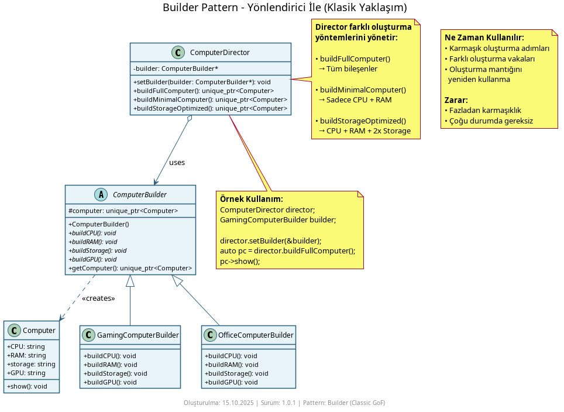

# Builder Pattern Nedir?

**Builder Pattern**, karmaşık nesneleri adım adım oluşturmak için kullanılan bir **oluşum kalıbıdır (creational pattern)**. Nesnenin tüm opsiyonları belirlendikten sonra inşa edilmesini sağlar. Çok sayıda seçimli parametre alan nesneler oluşturulurken kullanılır. Mesela, bir araba nesnesi oluştururken renk, motor türü, iç döşeme gibi birçok özellik seçilebilir.

## Ne İşe Yarar?

- **Karmaşık nesne oluşturma işini basitleştirir** - Çok parametreli constructor'lardan kurtarır
- **Adım adım nesne oluşturma** - CPU, RAM, Storage gibi bileşenleri tek tek ekleyebilirsiniz
- **Farklı temsiller** - Aynı yapım süreciyle farklı nesne türleri üretebilirsiniz (Gaming PC, Office PC)
- **Okunabilir kod** - `builder.buildCPU().buildRAM().build()` şeklinde zincirleme çağrılar vesilesiyle daha anlaşılır kod yazılır.

Örnekler

### 1. Basit Yaklaşım (Yönlendirici Yok)


```cpp
ComputerBuilder builder;
auto pc = builder.build()
```
**%90 durumda yeterli** - Doğrudan builder kullanımı, çağdaş C++ yaklaşımı.

### 2. Klasik Yaklaşım (Yönlendirici Var)



```cpp
ComputerDirector director;
GamingComputerBuilder builder;
director.setBuilder(&builder);
auto pc = director.buildFullComputer();
```
**%10 durumda gerekli** - Farklı sınıf oluşturma durumları için `Director` sınıfı eklenmiş.

### 3. İki Yaklaşımın Karşılaştırması


İki yöntemin fayda/zararlarını görsel olarak gösterir:
- **Basit:** Daha az kod, istemci (client) için kolay
- **Klasik:** Farklı sınıf oluşturma vakaları için Director kullanımı

Bilgisayar gibi çok bileşenli nesneler için idealdir. Kodunuz daha temiz ve bakımı kolay olur.

## Diğer Oluşturma Kalıplarıyla Farkları

- **Factory Method / Abstract Factory:** Fabrikalar hangi nesnenin üretileceğine odaklanır. Builder ise tek bir karmaşık nesneyi nasıl inşa edeceğine odaklanır. Factory sınıf seçimi yapar, Builder adım adım bileşenleri birleştirir.

- **Prototype:** Mevcut bir nesneyi klonlayıp değiştirir. Builder ise sıfırdan başlayarak adım adım yeni bir nesne inşa eder. Prototype varolan durumu kopyalar, Builder yeni durumu oluşturur.

- **Singleton:** Tek bir örnek garanti eder. Builder ise her çağrıda farklı konfigürasyonlarda yeni örnekler üretir. Singleton evrensel tek nesne için, Builder çok parametreli farklı nesneler için kullanılır.