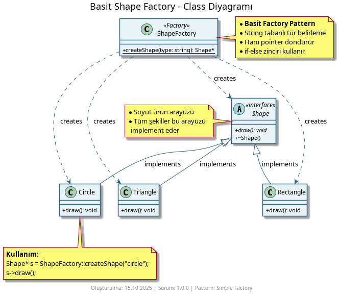
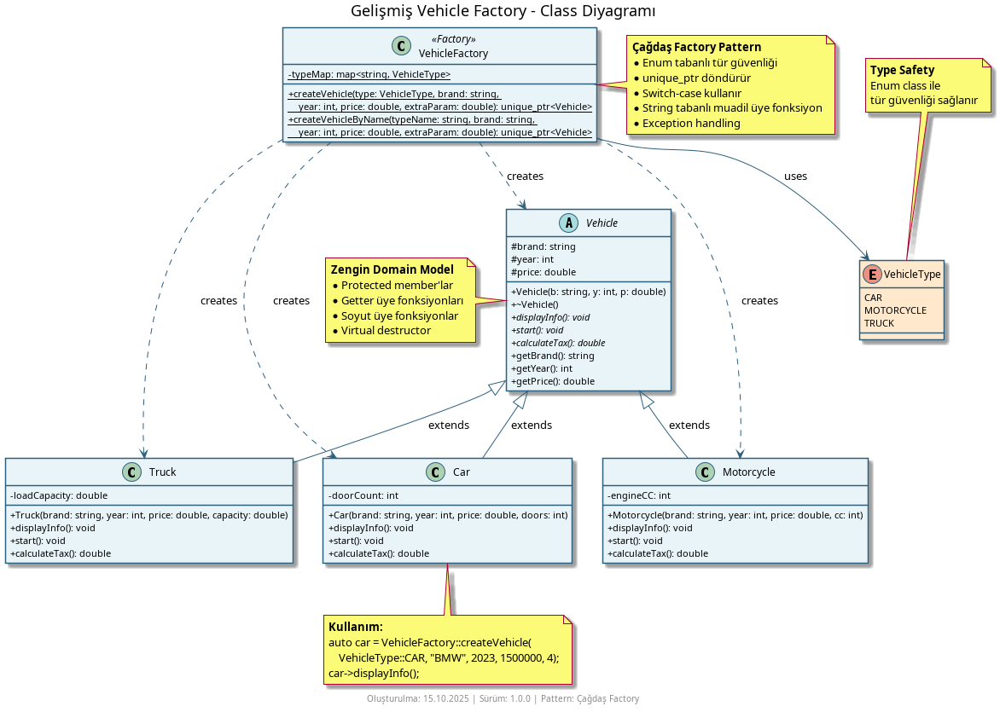
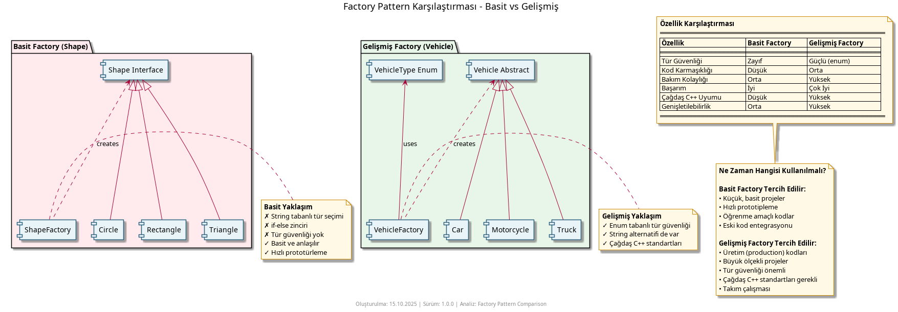

# Factory Pattern Nedir?

**Factory Pattern**, nesne oluşturma sorumluluğunu merkezi bir fabrikaya (factory) vererek istemci kodunun somut sınıflara doğrudan bağlılığını azaltan bir **oluşum kalıbıdır (creational pattern)**. Hangi tür nesne oluşturulacağı runtime'da belirlendiğinde kullanılır. Mesela, farklı veritabanı bağlantıları veya farklı ödeme yöntemleri oluşturmak için idealdir.

## Ne İşe Yarar?

- **Sınıf oluşturmayı soyutlar** - İstemci sadece bir tür veya isimle nesne ister, hangi somut sınıfın üretileceğini bilmez.
- **Yeni ürün tipi eklemeyi kolaylaştırır** - Yeni bir somut ürün eklemek genellikle fabrikanın güncellenmesiyle sınırlıdır.
- **Bellek yönetimi ve akıllı işaretçilerle uyumlu** - Fabrika, ownership kurallarını merkezi olarak uygulayabilir.

Örnekler

### 1. Basit string-tabanlı fabrika



Bu örnekte `ShapeFactory::createShape("circle")` gibi çağrılar somut `Circle`, `Rectangle`, `Triangle` nesnelerini döndürür.

```cpp
// Kullanım
Shape* shape = ShapeFactory::createShape("circle");
shape->draw();
```

### 2. Daha gelişmiş fabrika



Bu örnek, `VehicleFactory` ile `Car`, `Motorcycle`, `Truck` gibi somut sınıfları güvenli şekilde üretir. Hem enum hem de string tabanlı oluşturucu gösterilmiştir.

```cpp
// Örnek
auto car = VehicleFactory::createVehicle(VehicleType::CAR, "BMW", 2023, 1500000, 4);
car->displayInfo();
```

### İki yaklaşımın karşılaştırması



Farklı factory yaklaşımlarının fayda/zararlarını gösterir.

## Nasıl Çalışır

Fabrika, istemciden aldığı bir anahtar (string, enum veya yapılandırma) ile hangi somut sınıfın üretileceğine karar verir ve nesneyi soyut bir sınıf olarak döndürür. Böylece istemci, somut sınıfın ayrıntılarına bağlı kalmadan davranışları kullanabilir.