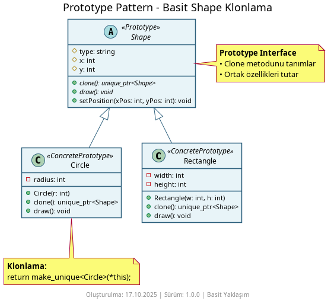
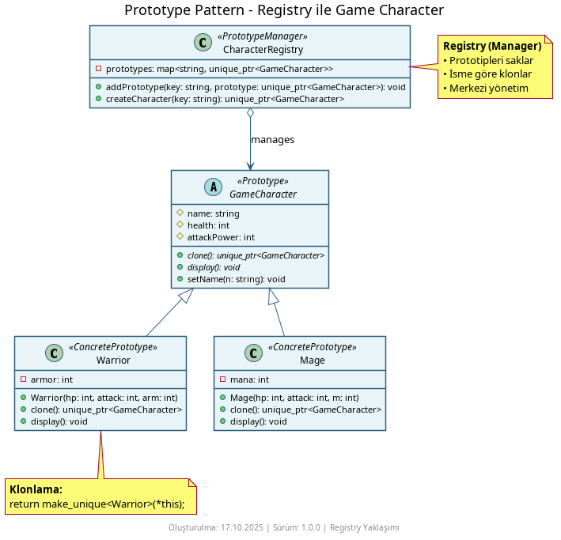
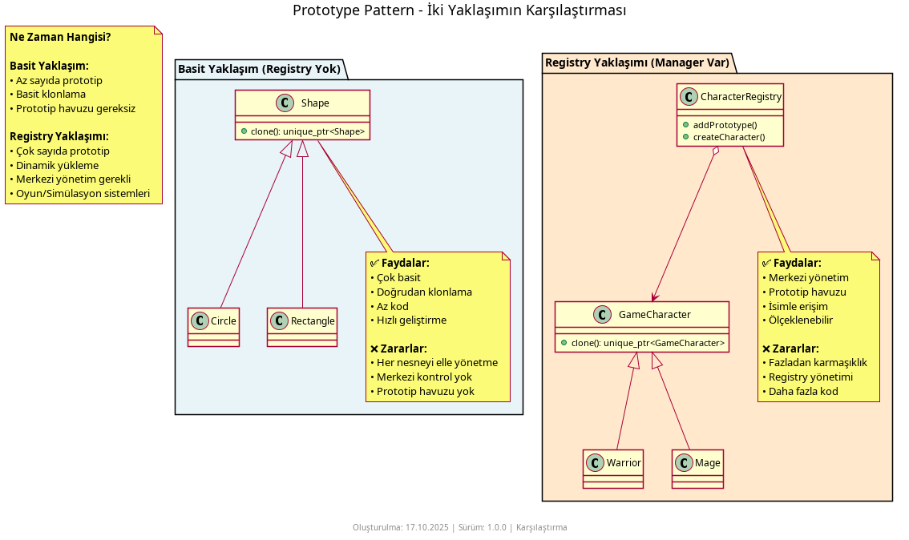

# Prototype Pattern Nedir?

**Prototype Pattern**, mevcut bir nesnenin kopyalanması (cloning) yoluyla yeni nesneler üretmeyi sağlayan bir **oluşum kalıbıdır (creational pattern)**. Yeni bir nesnenin oluşturulması pahalıysa veya çok sayıda kombinasyon/konfigürasyon varsa, mevcut bir örneği klonlayıp küçük değişikliklerle yeniden kullanmak daha verimli olabilir.

## Ne İşe Yarar?

- **Maliyetli oluşturmayı azaltır** – Ağır kurulum (I/O, büyük veri yükleme, karmaşık validasyon) gerektiren nesneleri bir kez oluşturup klonlayarak hız kazanırsınız.
- **Çalışma zamanında (runtime) çoğaltma** – Türünü bilmeden, yalnızca arayüz üzerinden polimorfik olarak kopyalayabilirsiniz.
- **Durum taşıyan nesneleri yeniden kullanma** – Varsayılan/şablon bir örnekten başlayıp küçük farklarla çoğaltma yaparsınız.
- **Derin/Sığ kopya kontrolü** – Kendi `clone()` implementasyonunuzla derin veya sığ kopyalama politikasını netleştirirsiniz.

## Örnekler

### 1. Basit Şekiller



Bu örnekte `Shape` taban sınıfı `clone()` ile klonlanır. Somut sınıflar (`Circle`, `Rectangle`) kendi durumlarını kopyalayarak yeni örnek döndürür.

```cpp
// Kullanım
std::unique_ptr<Shape> circle = std::make_unique<Circle>(10);
auto copy = circle->clone();
copy->moveTo(100, 50);
copy->draw();
```

### 2. Oyun Karakteri



Karakterlerin envanter, ekipman gibi bileşenleri olabilir. Klonlama sırasında bunların da uygun şekilde kopyalanması gerekir (genellikle derin kopya):

```cpp
// Örnek (fikir vermesi için)
std::unique_ptr<Character> base = std::make_unique<Rogue>("Ezio", 25);
auto assassin = base->clone(); // Derin kopya: envanter, silahlar kopyalanır
assassin->equip("Hidden Blade");
assassin->printStats();
```

### 3. Karşılaştırma Diyagramı



Şekil ve oyun karakteri örneklerinin farklı ihtiyaçlar (sığ/derin kopya) açısından karşılaştırmasını görselleştirir.

## Nasıl Çalışır

1. **Prototype Arayüzü**: `clone()` metodunu tanımlar (genellikle sanal/kopya yapıcı mantığıyla).
2. **Somut Prototipler**: Kendi alanlarını kopyalayarak yeni bir örnek üretir; derin/sığ kopya kararı burada verilir.
3. **İsteğe Bağlı Kayıt (Registry)**: Sık kullanılan prototipler bir haritada tutulur; anahtar ile `clone()` çağrılıp çoğaltılır.
4. **İstemci**: Somut sınıfı bilmeden, prototipten klon alır ve küçük değişiklikler uygular.

## Diğer Oluşturma Kalıplarıyla Farkları

- **Factory Method / Abstract Factory:** Fabrikalar her seferinde sıfırdan yeni nesneler üretir ve hangi sınıfın oluşturulacağını belirler. Prototype ise mevcut bir örneği kopyalar ve durumunu (state) korur. Factory "yarat", Prototype "kopyala" mantığıyla çalışır. Uygulamada Prototype sıklıkla factory kayıt defteriyle birlikte kullanılır.

- **Builder:** Builder karmaşık bir nesneyi adım adım sıfırdan inşa eder. Prototype ise zaten var olan bir nesneyi klonlayıp küçük değişiklikler yapar. Builder bileşen kombinasyonu, Prototype durum çoğaltma içindir.

- **Singleton:** Singleton bir sınıfın tek örneğini garanti eder. Prototype ise mevcut örneklerden istediğiniz kadar kopya üretmenizi sağlar. Singleton teklik, Prototype çoğaltma içindir.
