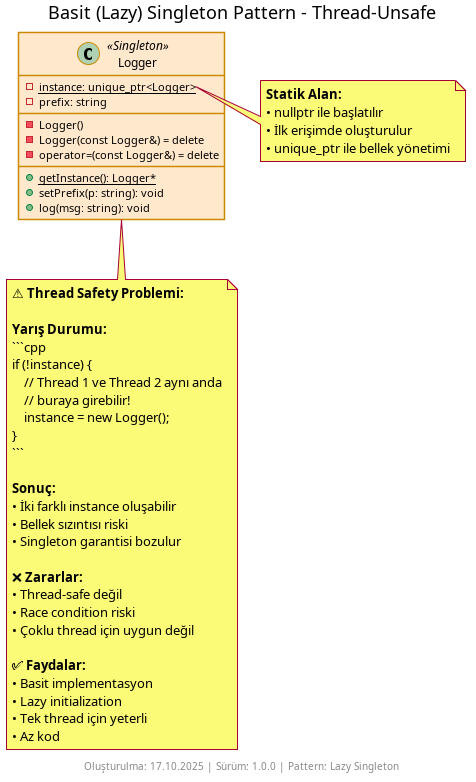

# Singleton Pattern Nedir?

**Singleton Pattern**, bir sınıfın yalnızca tek bir örneğe (instance) sahip olmasını ve bu örneğe evrensel bir erişim noktası sunulmasını sağlayan bir **oluşum kalıbıdır (creational pattern)**. Yapılandırma, günlükleyici, önbellek gibi tekil servislerin uygulama genelinde paylaşıldığı senaryolarda kullanılır.

## Ne İşe Yarar?

- **Tek örnek** – Uygulama boyunca bir sınıfın en fazla bir örneği bulunur.
- **Evrensel erişim** – `getInstance()`/`instance()` üzerinden aynı nesneye ulaşılır.
- **Kaynak paylaşımı** – Dosya/günlük yazımı, ayarlar gibi paylaşılan bileşenler için uygundur.

Ancak dikkat: Gereksiz evrensel durum (state) bağımlılığı oluşturabilir. Sınanabilirliği düşürmemek için kullanım alanını dar tutun.

## Örnekler

### 1) Basit (Lazy) Singleton – İş Parçacığı Güvenli Değil



```cpp
// Kullanım
Logger& logger = Logger::getInstance();
logger.log("Uygulama başladı");
```

Bu örnekte instance ilk istendiğinde oluşturulur (tembel başlatma). Çok iş parçacığında yarış durumu riski vardır.

### 2) İş Parçacığı Güvenli Singleton (Meyers Singleton)


```cpp
// Kullanım
Logger& logger = Logger::getInstance();
logger.log("İş parçacığı güvenli günlükleme");
```

Bu örnek C++11 ve sonrası için yerel statik değişken başlatmanın iş parçacığı güvenliği özelliğinden yararlanır.

### 3) İki Yaklaşımın Karşılaştırması


- **Lazy (basit):** Uygulaması kolaydır, fakat çok iş parçacıklı ortamlarda güvenli değildir.
- **Meyers (iş parçacığı güvenli):** Çağdaş C++'ta güvenli ve yalın bir yaklaşımdır.

## Nasıl Çalışır?

1. Kurucu gizlenir (private) ve kopyalama devre dışı bırakılır.
2. Sınıf kendi içinde tek örneği üretir ve saklar.
3. İstemci, sağlanan statik yöntemle aynı örneğe erişir.

## Ne Zaman Kullanılır?

- **Gerçekten tek bir kaynak gerekiyorsa** – Günlükleyici, önbellek, iş parçacığı havuzu gibi merkezi servisler
- **Evrensel erişim gerekli olduğunda** – Uygulama genelinde aynı nesneye erişim şart
- **Kaynak paylaşımı kritikse** – Dosya yazma, yapılandırma okuma gibi durumlar
- **Tembel başlatma istediğinizde** – İhtiyaç duyulana kadar nesne oluşturulmaz

## Ne Zaman Kullanılmaz?

- **Sınanabilirlik önemliyse** – Evrensel durum taklit etmeyi zorlaştırır
- **Çoklu örnek gerekebilecekse** – Singleton bu esnekliği kaldırır
- **Bağımlılık enjeksiyonu kullanıyorsanız** – Bağımlılık enjeksiyon kapları daha iyi kontrol sağlar
- **İş parçacığı güvenliği sağlanamıyorsa** – Yanlış gerçekleme yarış durumuna yol açar

## Diğer Oluşturma Kalıplarıyla Farkları

- **Factory Method / Abstract Factory:** Fabrikalar her çağrıda yeni nesneler üretebilir ve hangi sınıfın oluşturulacağını belirler. Singleton ise her zaman aynı tek örneği döndürür. Factory çeşitlilik ve çok biçimlilik, Singleton teklik ve evrensel erişim içindir.

- **Builder:** Builder her kullanımda farklı yapılandırmalarda yeni nesneler üretir. Singleton ise sadece bir örnek oluşturur ve onu paylaşır. Builder esneklik, Singleton tutarlılık sunar.

- **Prototype:** Prototype mevcut nesnelerden istediğiniz kadar kopya üretmenizi sağlar. Singleton ise kopyalamayı engeller ve tek bir örneği temin eder. Prototype çoğaltma, Singleton teklik ilkesiyle çalışır.
