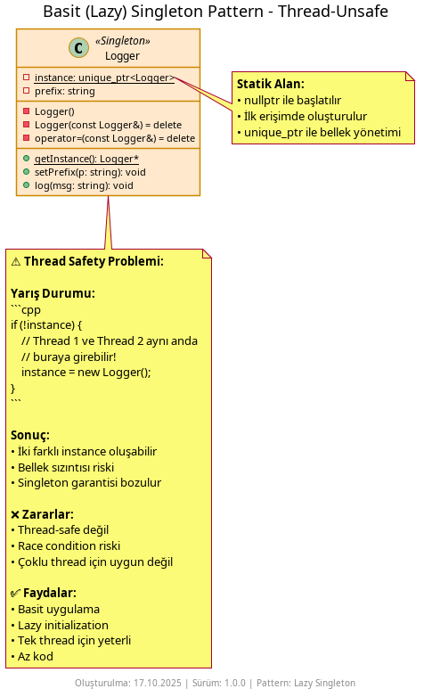
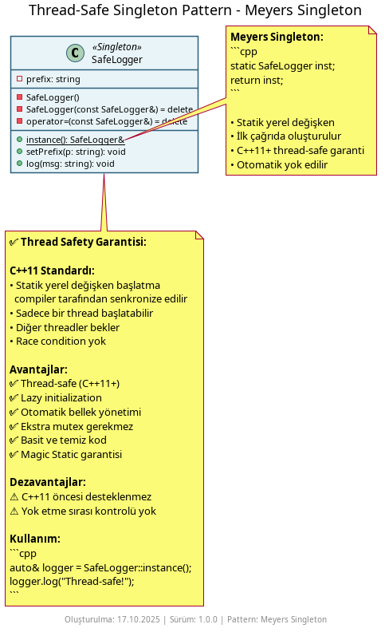
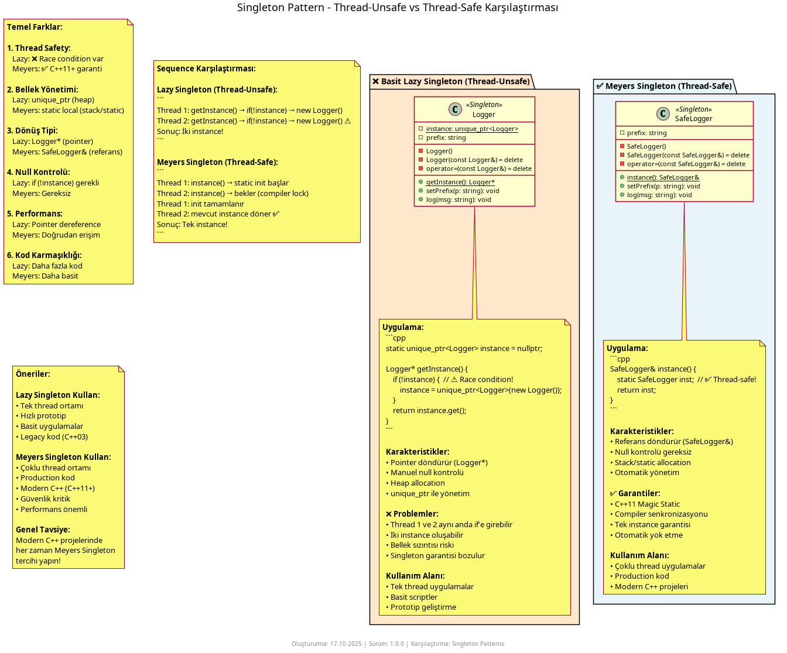

# Singleton Pattern Nedir?

**Singleton Pattern**, bir sınıfın yalnızca tek bir örneğe (instance) sahip olmasını ve bu örneğe evrensel bir erişim noktası sunulmasını sağlayan bir **oluşum kalıbıdır (creational pattern)**. Konfigürasyon, logger, cache gibi tekil servislerin uygulama genelinde paylaşıldığı senaryolarda kullanılır.

## Ne İşe Yarar?

- **Tek örnek** – Uygulama boyunca bir sınıfın en fazla bir örneği bulunur.
- **Evrensel erişim** – `getInstance()`/`instance()` üzerinden aynı nesneye ulaşılır.
- **Kaynak paylaşımı** – Dosya/log yazımı, ayarlar gibi paylaşılan bileşenler için uygundur.

Ancak dikkat: Gereksiz evrensel durum (state) bağımlılığı oluşturabilir. Test edilebilirliği düşürmemek için kullanım alanını dar tutun.

## Örnekler

### 1) Basit (Lazy) Singleton – Thread-Safe değil



```cpp
// Kullanım
Logger& logger = Logger::getInstance();
logger.log("Uygulama başladı");
```

Bu örnekte instance ilk istendiğinde oluşturulur (lazy initialization). Çok iş parçacığında (multi-thread) yarış koşulu riski vardır.

### 2) Thread-Safe Singleton (Meyers Singleton)



```cpp
// Kullanım
Logger& logger = Logger::getInstance();
logger.log("Thread-safe loglama");
```

Bu örnek C++11 ve sonrası için yerel statik değişken başlatmanın thread-safe garantisinden yararlanır.

### 3) İki Yaklaşımın Karşılaştırması



- **Lazy (basit):** Uygulaması kolaydır, fakat çok iş parçacıklı ortamlarda güvenli değildir.
- **Meyers (thread-safe):** Çağdaş C++’ta güvenli ve yalın bir yaklaşımdır.

## Nasıl Çalışır?

1. Kurucu gizlenir (private) ve kopyalama devre dışı bırakılır.
2. Sınıf kendi içinde tek örneği üretir ve saklar.
3. İstemci, sağlanan statik yöntemle aynı örneğe erişir.

## Ne Zaman Kullanılır?

- **Gerçekten tek bir kaynak gerekiyorsa** – Loglayıcı, cache, thread pool gibi merkezi servisler
- **Global erişim gerekli olduğunda** – Uygulama genelinde aynı nesneye erişim şart
- **Kaynak paylaşımı kritikse** – Dosya yazma, konfigürasyon okuma gibi durumlar
- **Lazy initialization istediğinizde** – İhtiyaç duyulana kadar nesne oluşturulmaz

## Ne Zaman Kullanılmaz?

- **Test edilebilirlik önemliyse** – Global state mock'lamayı zorlaştırır
- **Çoklu instance gerekebilecekse** – Singleton bu esnekliği kaldırır
- **Bağımlılık enjeksiyonu kullanıyorsanız** – DI container'lar daha iyi kontrol sağlar
- **Thread-safety garanti edilemiyorsa** – Yanlış implementasyon race condition'a yol açar

## Diğer Oluşturma Kalıplarıyla Farkları

- **Factory Method / Abstract Factory:** Fabrikalar her çağrıda yeni nesneler üretebilir ve hangi sınıfın oluşturulacağını belirler. Singleton ise her zaman aynı tek örneği döndürür. Factory çeşitlilik ve polimorfizm, Singleton teklik ve evrensel erişim içindir.

- **Builder:** Builder her kullanımda farklı konfigürasyonlarda yeni nesneler üretir. Singleton ise sadece bir örnek oluşturur ve onu paylaşır. Builder esneklik, Singleton tutarlılık sağlar.

- **Prototype:** Prototype mevcut nesnelerden istediğiniz kadar kopya üretmenizi sağlar. Singleton ise kopyalamayı engeller ve tek bir örneği garanti eder. Prototype çoğaltma, Singleton teklik ilkesiyle çalışır.
