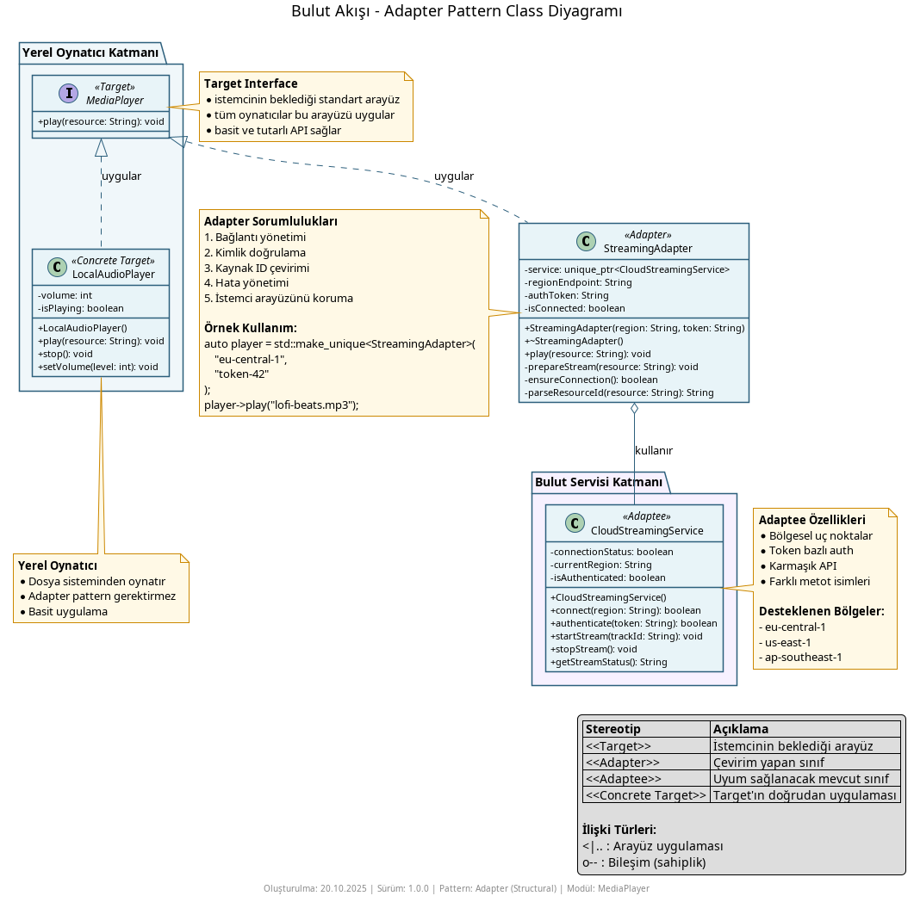
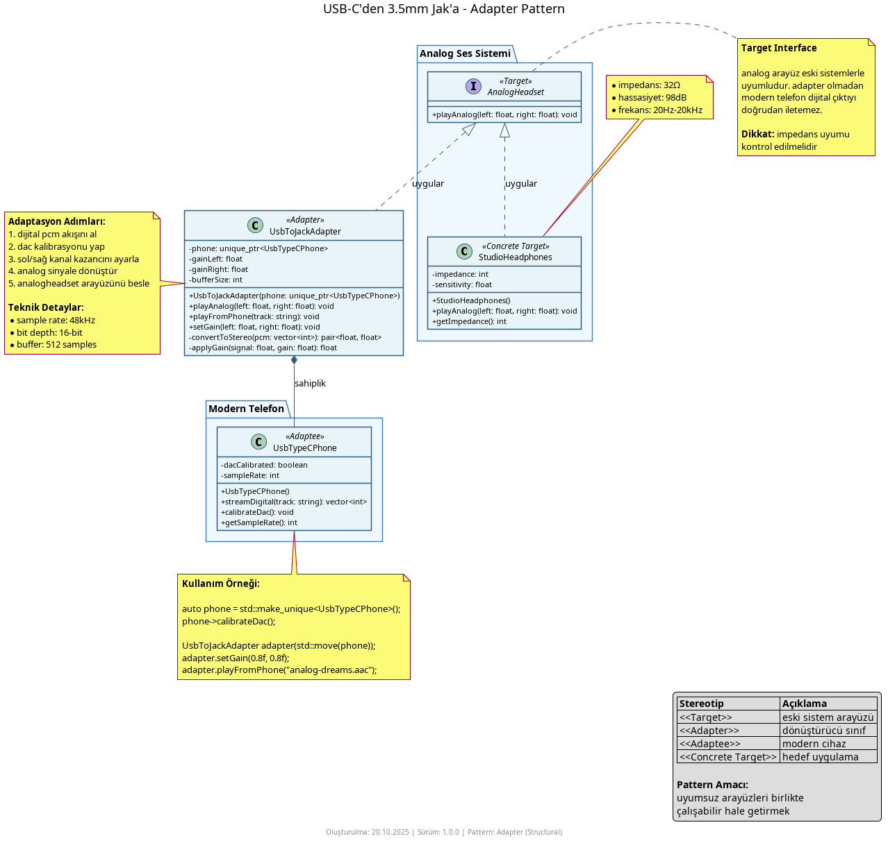
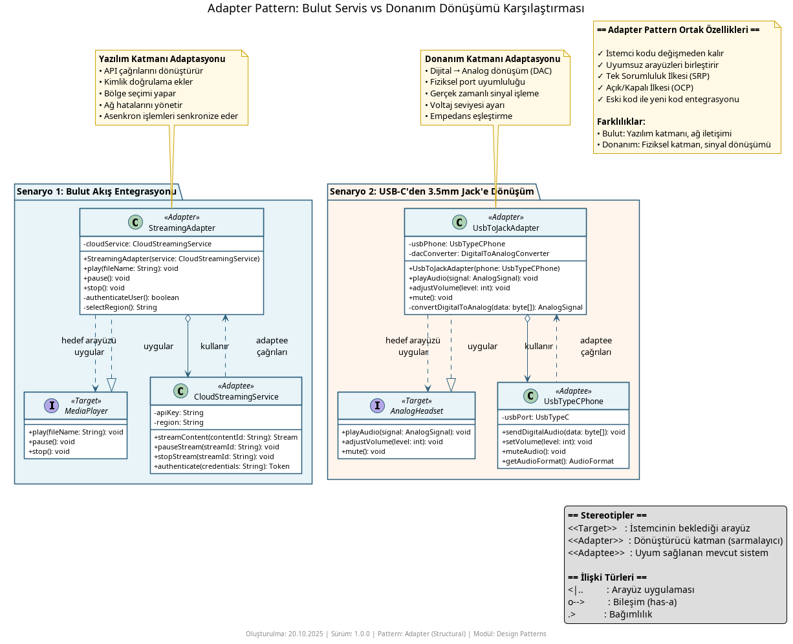

# Adapter Pattern Nedir?

**Adapter Pattern**, uyumsuz arayüzlere sahip sınıfları birlikte çalışabilir hale getiren bir **yapısal kalıptır (structural pattern)**. İstemci kodu beklediği arayüzü kullanmaya devam ederken, adapter sınıfı çağrıları hedef sınıfa çevirir. Böylece hem mevcut kod korunur hem de yeni sistemler entegre edilir.

## Ne İşe Yarar?

- **Uyumsuz arayüzleri bağlar** – Yeni veya üçüncü parti sistemleri mevcut arayüzlerle konuşturur
- **İstemciyi izole eder** – İstemci kodu, farklı sınıfların detaylarını bilmek zorunda kalmaz
- **Kod tekrarını azaltır** – Dönüşüm mantığı tek bir adapter sınıfında toplanır
- **Var olan davranışı korur** – Eski arayüzü bozmadan yeni yetenekler eklemeye izin verir

## Örnekler

### 1. Bulut Akışı (Cloud Streaming)



Yerel `MediaPlayer` arayüzü, üçüncü parti `CloudStreamingService` servisine uyarlanır. `StreamingAdapter`, bağlantı, kimlik doğrulama ve akış yönetimini üstlenirken istemci hâlâ aynı `play()` metodunu kullanır.

```cpp
// Kullanım
std::unique_ptr<MediaPlayer> player = std::make_unique<StreamingAdapter>("user", "pass");
player->play("song_id_123");
```

### 2. Eski Kulaklık (Legacy Audio)



`UsbToJackAdapter`, dijital USB-C telefon çıkışını analog kulaklığa çevirir. Dijital PCM verisi alınır, manuel olarak analog değerlere dönüştürülür ve `AnalogAudioOutput` arayüzüne uygun şekilde iletilir.

```cpp
// Kullanım
UsbTypeCPhone phone;
UsbToJackAdapter adapter(&phone);
AnalogHeadset headset;
phone.connectToAdapter(&adapter);
headset.plugIn(&adapter);
phone.playAudio("analog-dreams.aac");   
```

### 3. İki Vakanın Karşılaştırması



Karşılaştırma diyagramı, bulut servis uyarlaması ile fiziksel port uyarlamasının ortak noktalarını (**aynı arayüzü koruma**, **adapter üzerinden ek hazırlık adımları**) ve farklarını (**ağ çağrıları vs. gerçek zamanlı sinyal dönüştürme**, **yazılım entegrasyonu vs. donanım uyumluluğu**) yan yana gösterir.


## Nasıl Çalışır?

1. **Hedef arayüz (Target):** İstemcinin kullanmaya alışık olduğu arayüzdür (`MediaPlayer`, `AnalogAudioOutput`).
2. **Adaptee sınıfı:** Uyarlanmak istenen mevcut veya üçüncü parti sınıflardır (`CloudStreamingService`, `UsbTypeCPhone`).
3. **Adapter sınıfı:** Hedef arayüzü uygular ve çağrıları adaptee nesnesine dönüştürür (`StreamingAdapter`, `UsbToJackAdapter`).
4. **İstemci:** Sadece hedef arayüz ile etkileşir; altyapının nasıl değiştiğini bilmez.

Bu yapı sayesinde istemci kodu değişmeden yeni servisler veya cihazlar entegre edilir.

## Ne Zaman Kullanılır?

- **Üçüncü parti kütüphaneleri mevcut arayüzlere uydurmanız gerekiyorsa**
- **Eski sistemi bozmadan yeni sistem eklemek istiyorsanız**
- **Farklı veri formatları veya protokoller arasında köprü kurmanız gerektiğinde**
- **Test veya prototip için bağımlılıkları sarmak isterseniz**

## Ne Zaman Kullanılmaz?

- **Arayüzler zaten uyumluysa** – Fazladan katman gereksiz karmaşıklık getirir
- **Yeni sistemi doğrudan değiştirebiliyorsanız** – Adaptee üzerinde değişiklik yapmak mümkünse adapter şart değildir
- **Performans kritikse** – Ek çağrı zinciri ek yük oluşturabilir
- **Sadece basit veri dönüştürmesi gerekiyorsa** – Kolay bir yardımcı fonksiyon yeterli olabilir

## Diğer Yapısal Kalıplarla Farkları

- **Facade:** Facade karmaşık alt sistemleri basitleştirir; adapter ise uyumsuz arayüzleri dönüştürür. Adapter uyumluluk, facade kullanım kolaylığı sağlar.
- **Decorator:** Decorator mevcut nesneye yeni davranış ekler fakat aynı arayüzü korur. Adapter arayüz değiştirir, davranış eklemez.
- **Bridge:** Bridge soyutlama ile implementasyonu ayırır ve birlikte evrimleşmelerine yardım eder. Adapter, halihazırda var olan iki arayüzü sonradan bağlamak için kullanılır.
