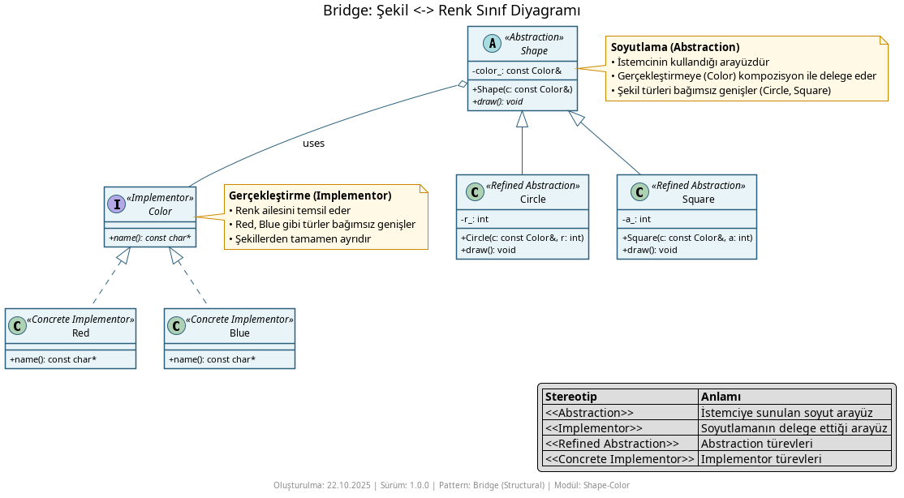
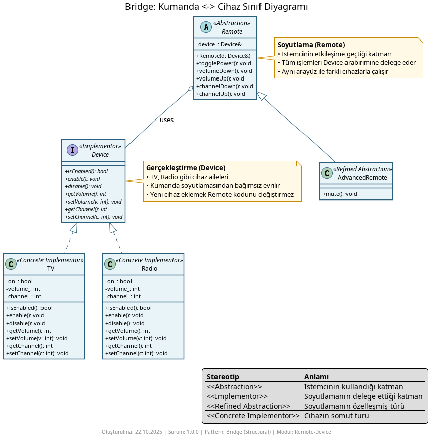
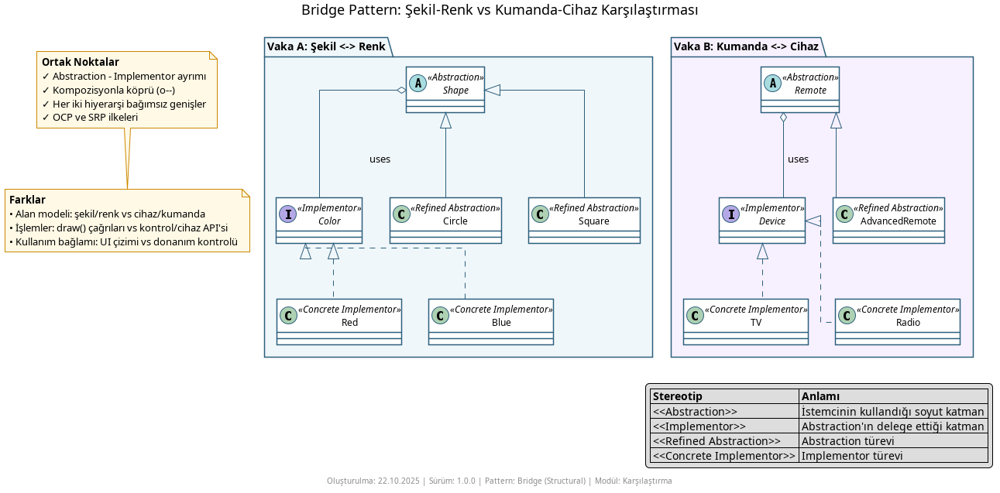

# Bridge Pattern Nedir?

**Bridge Pattern**, bir soyutlamayı (abstraction) gerçekleme/uygulama (implementation) hiyerarşisinden ayırarak ikisinin de birbirinden bağımsız evrilmesini sağlar. Böylece iki (veya daha fazla) boyutta büyüyen sınıf kombinasyonlarında sınıf patlaması (Cartesian ürün) yaşamadan tasarım yapılır.

## Hangi durumda Bridge aklımıza gelmeli?

- Aynı kavramın iki ekseni bağımsızca değişiyorsa ve ikisini birden kalıtımla birleştirmek sınıf patlamasına yol açıyorsa. Örn: **Şekil türleri** (daire, kare) ve **renk** (kırmızı, mavi).
- Soyut bir denetim katmanının (kumanda) farklı gerçeklemelerle (TV, Radyo) çalışması isteniyorsa ve ikisi de ayrı ayrı genişlemeye devam edecekse.
- Bir arayüzün değişmesi muhtemel, fakat istemcinin kullandığı soyutlama sabit kalmalıysa.
- Derin kalıtım hiyerarşileri yerine, **kompozisyon ile delege** ederek esnek kalmak istiyorsanız.

## Ne İşe Yarar?

- **Soyutlama ile gerçekleştirmeyi ayırır** – Her iki hiyerarşi bağımsız genişler.
- **Sınıf patlamasını önler** – İki eksenin ürününe göre sınıf üretmek yerine kompozisyon kullanır.
- **Bağımlılığı azaltır** – İstemci soyutlamaya konuşur, gerçekleştirme detayları gizlenir.
- **Test edilebilirlik** – Implementor sahte (mock) ile değiştirilebilir.

## Örnekler

### 1) Şekil <-> Renk (Shape ↔ Color)

`Shape` soyutlaması (daire, kare), `Color` gerçekleştirmesine kompozisyonla (o--) delege eder. Aynı şekli farklı renklerle çizmek için yeni sınıf yazmak gerekmez; eksenler ayrıdır.

Temel fikir: `Shape` içinde `const Color&` tut ve `draw()` içinde `color.name()` kullan.

### 2) Kumanda <-> Cihaz (Remote ↔ Device)

`Remote` soyutlaması, `Device` arabirimine kompozisyonla delege eder. Aynı kumanda davranışı farklı cihazlarla (TV, Radyo) çalışabilir. Cihaza yeni özellik eklendiğinde kumanda soyutlaması değişmek zorunda değildir.

### 3) İki Vakanın Karşılaştırması

Karşılaştırma diyagramı, iki vakanın ortak noktalarını (Abstraction ↔ Implementor ayrımı, kompozisyon) ve farklarını (UI çizimi vs. cihaz kontrolü bağlamı) özetler.

## Nasıl Çalışır?

1. **Abstraction (Soyutlama):** İstemcinin kullandığı arayüzdür (örn. `Shape`, `Remote`).
2. **Refined Abstraction:** Soyutlamanın türevleridir (örn. `Circle`, `Square`, `AdvancedRemote`).
3. **Implementor (Gerçekleştirme):** Soyutlamanın delege ettiği arayüzdür (örn. `Color`, `Device`).
4. **Concrete Implementor:** Implementor’un somut türleridir (örn. `Red`, `Blue`, `TV`, `Radio`).

Kompozisyon ile köprü kurulur: Abstraction, bir Implementor referansı tutar ve operasyonlarını ona delege eder. İki hiyerarşi birbirinden bağımsız değişebilir.

## Ne Zaman Kullanılmaz?

- Yalnızca tek eksen değişiyorsa ve ikinci bir boyut yoksa – basit kalıtım yeterli olabilir.
- Eksenlerden biri asla değişmeyecekse – fazladan soyutlama gereksiz olabilir.
- Aşırı soyutlama, gereksiz dolaylama ve karmaşıklık ekliyorsa.

## Diğer Yapısal Kalıplarla Farkları

- **Adapter:** Var olan, uyumsuz iki arayüzü sonradan bağlar. Bridge, iki hiyerarşiyi en baştan ayrıştırır ve birlikte evrimleşmelerine izin verir.
- **Decorator:** Aynı arayüzü koruyarak nesneye yeni davranışlar ekler (katmanlama). Bridge arayüz dönüştürmez; soyutlama ile implementasyonu ayırır.
- **Facade:** Karmaşık alt sistemleri basitleştirir. Bridge ise iki eksenli hiyerarşileri ayırır.
- **Composite:** Ağaç yapıları tekil nesne gibi ele alır. Bridge ise iki bağımsız hiyerarşiyi köprüler.