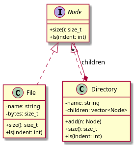
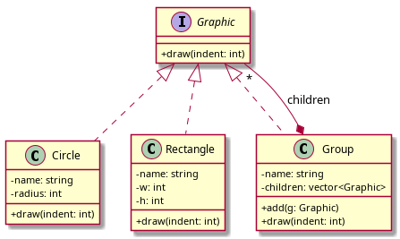
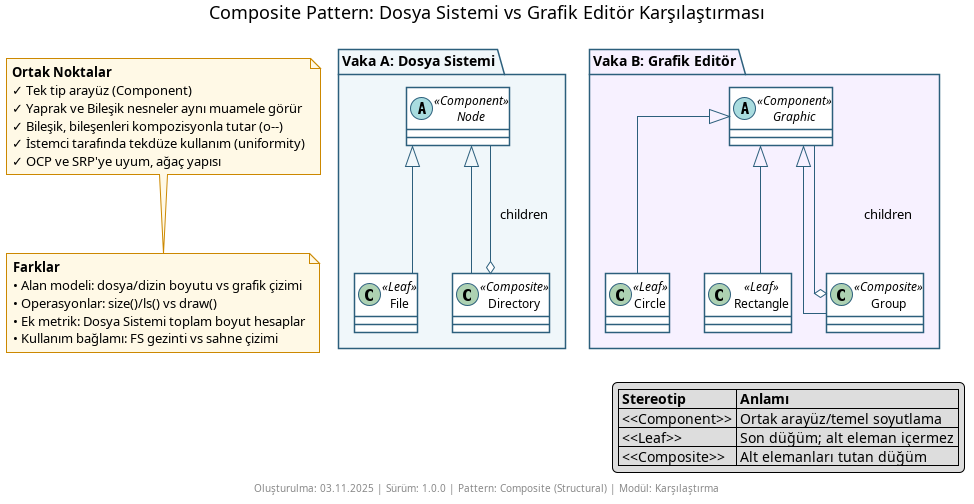

# Composite Pattern Nedir?

**Composite Pattern**, parça-bütün (part–whole) ilişkilerini ağaç yapısı ile modelleyip, tekil nesneleri (**Leaf**) ve grupları (**Composite**) aynı arayüz üzerinden **tek tipmiş gibi** kullanmayı sağlayan bir **yapısal kalıptır (structural pattern)**. İstemci kodu, tek bir öğe ile bir grup öğe arasında ayrım yapmadan aynı operasyonları çağırabilir.

## Ne İşe Yarar?

- **Tek arayüz, iki rol** – Hem yaprak (tekil) hem bileşik (grup) nesneler aynı arayüzü uygular
- **Özyinelemeli bileşim** – Composite kendi içinde birden çok `Component` tutar; işlemler çocuklara aktarılır
- **İstemciyi basitleştirir** – “Tekil mi, grup mu?” tetkiki gerekmeden aynı kod çalışır
- **Toplamsal işlemler kolay** – Boyut, maliyet, çizim gibi işlemler ağaçta yukarıdan aşağıya doğal olarak birikir
- **Açık/Kapalı prensibi** – Yeni yaprak veya bileşik türleri eklemek mevcut istemci kodunu bozmaz

## Örnekler

### 1. Dosya Sistemi (File System)



`Node` arayüzü, `File` (Leaf) ve `Directory` (Composite) tarafından uygulanır. Dizin, alt öğelerini (dosya ya da dizin) aynı arayüz üzerinden işler; toplam boyut gibi işlemler otomatik birikir.

```cpp
// Kullanımdan kesit (özet)
std::unique_ptr<Node> root = std::make_unique<Directory>("root");
// ... alt öğeler eklenir
std::cout << "Total size: " << root->size() << " bytes\n";
```

### 2. Grafik Editörü (Graphic Editor)



`Graphic` arayüzünü `Circle` ve `Rectangle` (Leaf), `Group` ise (Composite) uygular. İstemci, tekil şekillerle grupları aynı şekilde `draw()` ederek kullanır.

```cpp
// Kullanımdan kesit (özet)
Group scene("Scene");
scene.add(std::make_unique<Circle>("sun", 5));
scene.add(std::make_unique<Rectangle>("ground", 20, 3));
scene.draw();
```

### 3. İki Vakanın Karşılaştırması



Karşılaştırma diyagramı, iki örneğin ortak noktalarını (aynı arayüz, özyinelemeli bileşim) ve bağlama özgü farklarını (toplam boyut hesabı vs. sahne/katman çizimi) yan yana gösterir.

## Nasıl Çalışır?

1. **Component (Arayüz):** İstemcinin konuştuğu ortak sözleşme (`Node`, `Graphic`)
2. **Leaf (Yaprak):** Alt öğesi olmayan tekil nesne (`File`, `Circle`, `Rectangle`)
3. **Composite (Bileşik):** Birden çok `Component` tutar ve operasyonları çocuklarına delege eder (`Directory`, `Group`)
4. **İstemci:** `Component` arayüzü ile çalışır; tekil/grup ayrıntısını bilmez

Tipik operasyonlar (örn. `size()`, `draw()`) Composite tarafında çocukları dolaşarak (iterate) çalışır; Leaf tarafında doğrudan gerçeklenir. Çocuk yönetimi için `add/remove/getChild` gibi yardımcılar Composite’te bulunur. Sahiplik/ömür yönetiminde modern C++’ta `std::unique_ptr` tercih edilir.

## Ne Zaman Kullanılır?

- Parça–bütün ilişkisini ağaç yapısıyla temsil etmek istiyorsanız
- Tekil ve bileşik nesneleri **tek tip** ele almak (uniform treatment) istiyorsanız
- Toplamsal/katmanlı işlemler (toplam boyut, toplam maliyet, sahne çizimi) yapıyorsanız
- UI hiyerarşileri, sahne grafı, dosya sistemi, organizasyon şeması gibi doğal ağaç yapıları varsa

## Ne Zaman Kullanılmaz?

- Yapınız **düz** (flat) ve gruplama gerekmiyorsa – basit liste yeterli olabilir
- Çocuk türlerini **sıkı** şekilde sınırlandırmanız ve kapsamlı doğrulama yapmanız gerekiyorsa
- Performans kritik ve derin özyinelemeli dolaşım ek yük getiriyorsa
- Kompozisyon yerine tek bir nesnenin davranışını genişletmek istiyorsanız (bkz. Decorator)

## Diğer Yapısal Kalıplarla Farkları

- **Decorator:** Decorator tek bir nesneye katmanlı yeni davranış ekler; Composite çok sayıda çocuğu tek bir bütün olarak ele alır. İkisi de kompozisyon kullanır fakat amaç farklıdır.
- **Bridge:** Bridge iki hiyerarşi eksenini (soyutlama × uygulama) ayırır; Composite parça–bütün ağaçlarını modeller.
- **Facade:** Facade karmaşık alt sistemi basit arayüzle sarmalar; Composite ise hiyerarşiyi kurup tekil/grup için ortak arayüz sunar.
- **Adapter:** Adapter uyumsuz arayüzleri dönüştürür; Composite arayüz dönüştürmez, hiyerarşik bileşimi sağlar.