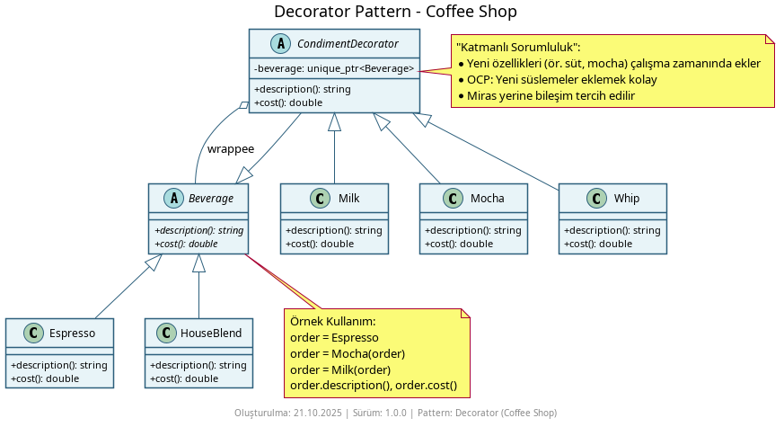
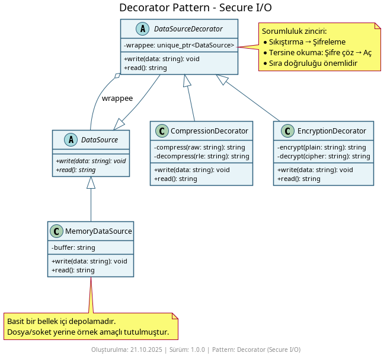
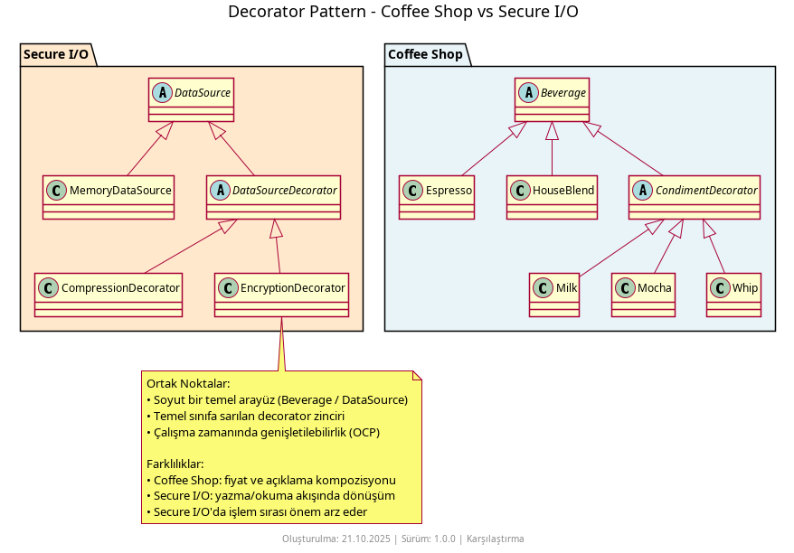

# Decorator Pattern Nedir?

**Decorator Pattern**, mevcut bir nesneye çalışma zamanında yeni sorumluluklar/özellikler eklemeyi sağlayan bir **yapısal kalıptır (structural pattern)**. Miras almadan, aynı arayüzü koruyarak davranışı katmanlı şekilde genişletebilirsiniz. Böylece sınıf patlaması (farklı kombinasyonlar için çok fazla alt sınıf) engellenir ve Açık/Kapalı Prensibi (OCP) desteklenir.

## Ne İşe Yarar?

- **Davranışı dinamik ekler** – Nesne davranışını dekoratörler ile katmanlı olarak artırır
- **Aynı arayüz** – İstemci aynı arayüzü kullanmaya devam eder
- **Bileşim > Kalıtım** – Yeni özellik eklemek için miras yerine sarmalama
- **Kombinasyon esnekliği** – Farklı süslemeler farklı sıralarla birleştirilebilir

## Örnekler

### 1. Coffee Shop (Beverage Süslemeleri)



Klasik kahve örneği. `Beverage` arayüzü üzerine `Milk`, `Mocha`, `Whip` gibi süslemeler eklenir ve fiyat/ açıklama buna göre kompoze edilir.

```cpp
// Kullanım (özet)
std::unique_ptr<Beverage> order = std::make_unique<Espresso>();
order = std::make_unique<Mocha>(std::move(order));
order = std::make_unique<Milk>(std::move(order));
std::cout << order->description() << " -> $" << order->cost();
```

### 2. Secure I/O (Sıkıştırma + Şifreleme)



`DataSource` arayüzü üzerinde `CompressionDecorator` ve `EncryptionDecorator` ile veri yazma/okuma sürecine dinamik sorumluluklar eklenir. İşlem sırası önemlidir (genellikle önce sıkıştırma, sonra şifreleme). 

```cpp
// Kullanım (özet)
std::unique_ptr<DataSource> pipeline = std::make_unique<CompressionDecorator>(
    std::make_unique<EncryptionDecorator>(
        std::make_unique<MemoryDataSource>()));

const std::string payload = "...";
pipeline->write(payload);
auto restored = pipeline->read();
```

### 3. İki Vakanın Karşılaştırması



Karşılaştırma diyagramı, iki örneğin ortak noktalarını (aynı arayüz, katmanlı genişletme, çalışma zamanında esneklik) ve farklarını (fiyat/açıklama kompozisyonu vs. veri dönüşümü; sıra bağımlılığı) gösterir.

## Nasıl Çalışır?

1. **Bileşen (Component):** Ortak arayüzü tanımlar (`Beverage`, `DataSource`).
2. **Somut Bileşen:** Temel davranışı sağlar (`Espresso`, `HouseBlend`, `MemoryDataSource`).
3. **Decorator Temeli:** Component arayüzünü uygular ve bir Component referansı tutar (`CondimentDecorator`, `DataSourceDecorator`).
4. **Somut Decorator:** Ek davranışı override ederek ekler (`Milk`, `Mocha`, `Whip`, `CompressionDecorator`, `EncryptionDecorator`).

## Ne Zaman Kullanılır?

- **Seçmeli özellikler** çalışma zamanında eklenmek isteniyorsa
- **Sınıf patlaması** (özellik kombinasyonları) riskine karşı daha esnek bir yaklaşım gerekiyorsa
- **Kalıtımdan kaçınmak** ve **bileşimi tercih etmek** istiyorsanız
- **Aynı arayüzü koruyarak** davranışı genişletmek istiyorsanız

## Ne Zaman Kullanılmaz?

- Özellik takımı **sabit** ve **nadiren değişiyorsa** – Miras ile basit çözüm yeterli olabilir
- **Hız önemlidir** ve çok sayıda katmanlı çağrı ek yük oluşturuyorsa
- Dekoratörlerin **sırası** anlamlı değilse ve davranışlar bağımsızsa (basit yardımcı fonksiyon yeterli olabilir)

## Diğer Yapısal Kalıplarla Farkları

- **Adapter:** Adapter uyumsuz arayüzleri dönüştürür; Decorator aynı arayüzü korur ve davranışı genişletir.
- **Facade:** Facade karmaşık alt sistemleri tek arayüzle basitleştirir; Decorator tek nesnenin davranışını katmanlı genişletir.
- **Proxy:** Proxy bir nesneye erişimi yönetir (aynı arayüz); Decorator yeni davranış ekler (genişletme).