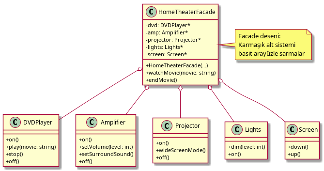
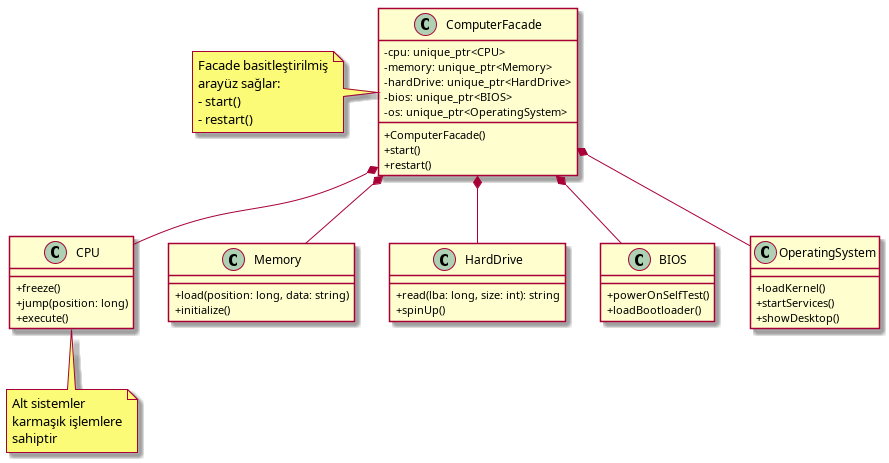
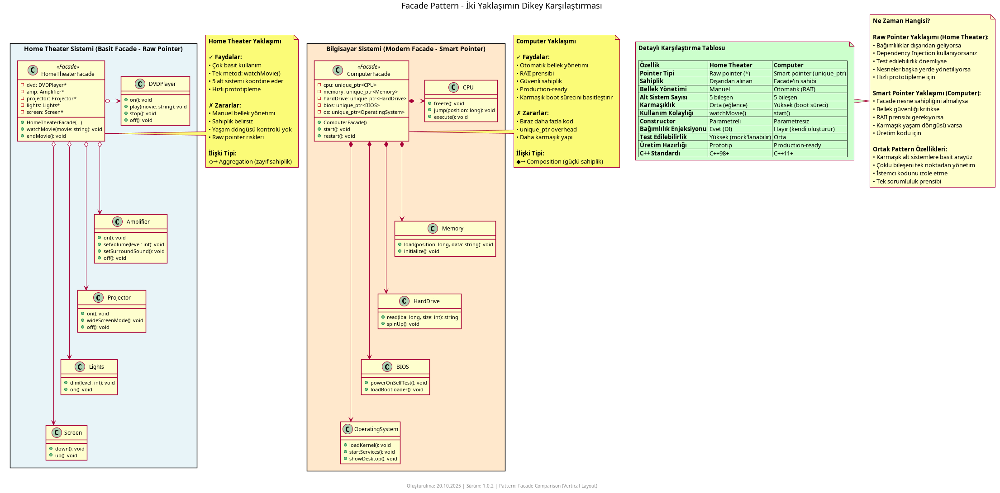

# Facade Pattern Nedir?

**Facade Pattern**, karmaşık bir alt sistemi basit ve anlaşılır bir arayüzle sarmalar. Bu kalıp, istemci kodunun alt sistemin karmaşıklığından korunmasını sağlayan bir **yapısal kalıptır (structural pattern)**. Mesela, bir ev sinema sistemi kurmak için DVD oynatıcı, amplifikatör, projektör, ışıklar ve ekran gibi birçok bileşeni tek bir tuşla yönetmek için kullanılabilir.

## Ne İşe Yarar?

- **Karmaşık sistemi basitleştirir** – Çok sayıda alt sistem bileşenini tek bir arayüzden yönetir
- **Alt sistem bağımlılıklarını azaltır** – İstemci, alt sistemin iç ayrıntılarını bilmek zorunda kalmaz
- **Kullanımı kolaylaştırır** – Tek bir yöntem çağrısı ile birden fazla işlemi gerçekleştirir
- **Kod tekrarını önler** – Sık kullanılan işlem dizileri tek bir yerde toplanır

## Örnekler

### 1. Ev Sinema Sistemi (Home Theater)



Klasik facade örneği. DVD player, amplifier, projector, lights ve screen gibi birçok bileşeni tek bir basit arayüzle yönetir.

```cpp
// Kullanım
HomeTheaterFacade theater(dvd, amp, proj, lights, screen);
theater.watchMovie("Inception");
theater.endMovie();
```

### 2. Bilgisayar Başlatma (Computer Startup)



Bilgisayar başlatma sürecinin karmaşıklığını gösteren örnek. CPU, Memory, HardDrive, BIOS ve OS gibi bileşenleri yönetir.

```cpp
// Kullanım
ComputerFacade computer;
computer.start(); // Tüm başlatma işlemlerini yönetir
```

### 3. İki Yaklaşımın Karşılaştırması



İki farklı facade kullanım senaryosunun karşılaştırması:
- **Ev Sinema Sistemi:** Eğlence sistemi yönetimi
- **Bilgisayar Başlatma:** Sistem başlatma süreçleri

## Nasıl Çalışır?

1. **Facade sınıfı:** Alt sistemlere basit bir arayüz sunar ve karmaşık işlemleri yönetir
2. **Alt sistemler:** Facade tarafından kullanılan bağımsız karmaşık bileşenler (CPU, Memory, DVD, Amplifier vb.)
3. **İstemci:** Sadece facade ile iletişim kurar, alt sistemlerin ayrıntılarını bilmez
4. **Basit arayüz:** İstemci tek bir yöntem çağrısı ile birden fazla alt sistem işlemini gerçekleştirir

Facade, alt sistemlerin yöntemlerini düzenli bir sırada çağırarak karmaşık işlemleri otomatikleştirir.

## Ne Zaman Kullanılır?

- **Karmaşık alt sistemler basitleştirilecekse** – Çok sayıda bileşen ve onların etkileşimleri varsa
- **Alt sistemlere bağımlılığı azaltmak istiyorsanız** – İstemci kodunu alt sistem değişikliklerinden korur
- **Katmanlı mimari oluşturuyorsanız** – Her katman bir facade ile temsil edilebilir
- **Sık kullanılan işlem dizileri varsa** – Tekrar eden kod bloklarını tek yerde toplar

## Ne Zaman Kullanılmaz?

- **Basit sistemlerde** – Sadece birkaç sınıf varsa gereksiz soyutlama oluşturur
- **Tüm alt sistem işlevlerine erişim gerekiyorsa** – Facade bazı ayrıntılı işlemleri gizleyebilir
- **Alt sistem zaten basitse** – Fazladan katman karmaşıklık getirir
- **Hız çok önemliyse** – Fazladan bir dolaylama katmanı ekler

## Diğer Yapısal Kalıplarla Farkları

- **Adapter:** Adapter uyumsuz arayüzleri uyumlu hale getirir (arayüz dönüşümü). Facade ise karmaşık alt sistemi basitleştirir (basitleştirme). Adapter uyumluluk, Facade basitlik sağlar.

- **Decorator:** Decorator mevcut bir nesneye dinamik olarak yeni davranışlar ekler. Facade ise birden fazla nesneyi tek bir basit arayüzle sarmallar. Decorator işlevsellik ekleme, Facade karmaşıklık gizleme içindir.

- **Proxy:** Proxy bir nesneye erişimi kontrol eder veya geciktirir (aynı arayüz). Facade ise çok sayıda nesneyi basit bir arayüzle sunar (yeni arayüz). Proxy erişim kontrolü, Facade basitleştirme yapar.

